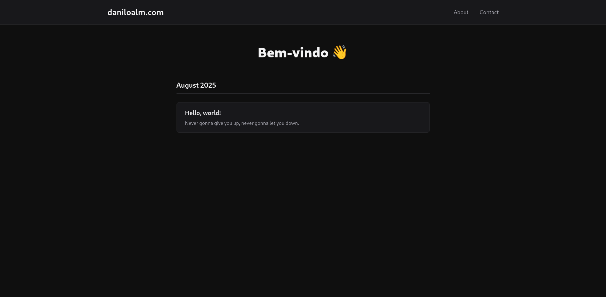
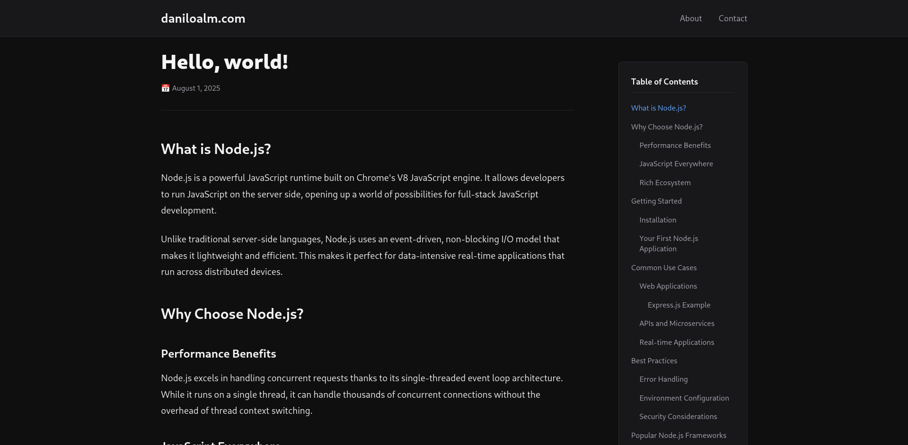
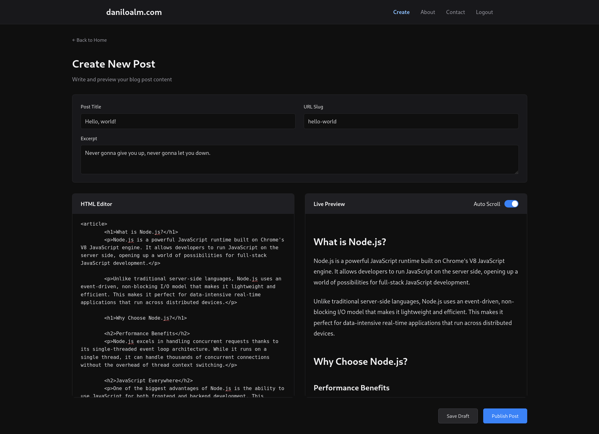
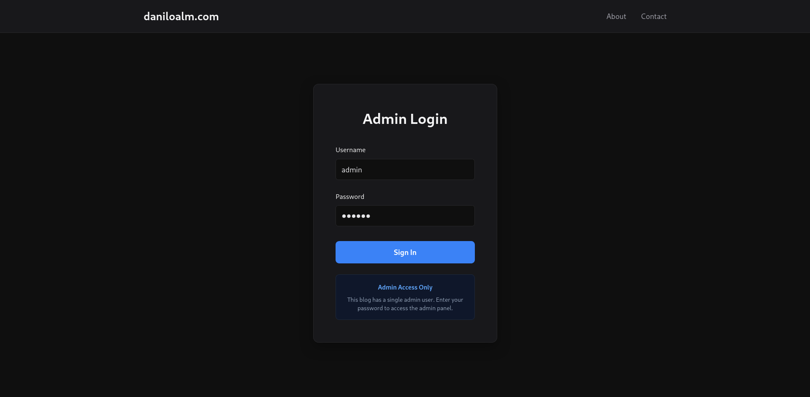
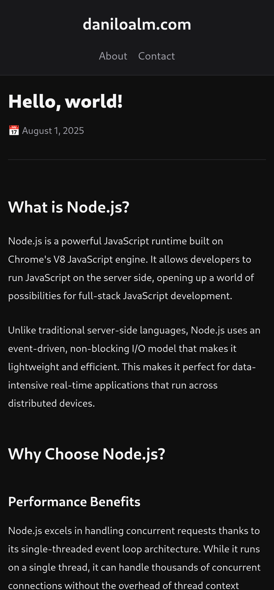

# Blog

A simple blog application built with NestJS.

## Features

- **Responsive Design**: Optimized for desktop, tablet, and mobile devices
- **Table of Contents**: Auto-generated navigation for long articles
- **Clean URLs:** Readable URLs (year/month/day/article-title-slugified)
- **Auth:** Endpoint for uploading and API is protected

## Screenshots

### Home Page


### Article View


### Write Article View


### Login View


### Mobile View


## Installation

### Docker

```bash
# Create a directory somewhere
mkdir blog && cd blog

# Compose and .env files
curl https://raw.githubusercontent.com/danilo-alm/blog/refs/heads/main/compose.yml -o compose.yml
curl https://raw.githubusercontent.com/danilo-alm/blog/refs/heads/main/.env.docker -o .env.docker

# Spin up container
docker compose up
```

### Locally

```bash
# Clone the repository
git clone https://github.com/danilo-alm/blog

# Install dependencies
yarn install

# Set up environment variables
cp .env.example .env

# Start DB (Sqlite)
npx prisma migrate deploy

# Compile & Run
yarn run start:dev
```

## As The Blog Admin...

You should know that:

- The default admin password is `secret`. Change ADMIN_PASSWORD_HASH in `.env` or `.env.docker` if needed (Bcrypt).
- A post can have headings level 1-3 in its content. Upon publishing, they'll be converted to 2-4
- HTML Sanitization and Minification **is** performed. Sanitization details can be seen in [sanitize-post-content.ts](src/common/sanitizer/sanitize-post-content.ts), which is also bundled to the browser (ESBuild)
- New posts can be uploaded in `/admin/upload` (authentication needed)

## Technologies Used

- Frontend: HTML + CSS + JS
- Backend: NestJS
- Database: Sqlite

## Missing Features

Things that would be neat have in the future.

- Edit articles view
- Search articles
- Categories / Tags
- Light Theme
- Look into SEO Optimization

## License

This project is licensed under the GNU General Public License v3.0 - see the LICENSE file for details.
